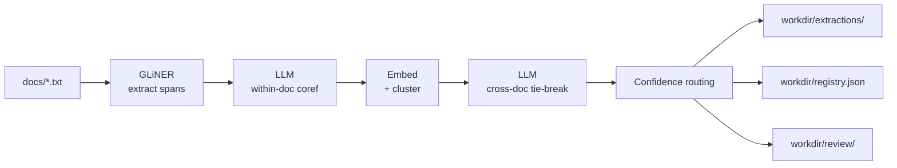

# 2 · Run the pipeline

With a schema in hand, you can run the full extract → coref → cross-doc
pipeline in one command.

## Prepare some documents

Drop three short text files under `docs/`:

```text title="docs/curie_1.txt"
Marie Curie discovered polonium in 1898. The element was named after her
native Poland. She and her husband Pierre Curie shared the 1903 Nobel
Prize in Physics with Henri Becquerel.
```

```text title="docs/curie_2.txt"
The University of Warsaw rejected M. Curie because she was a woman. She
moved to Paris, where she enrolled at the Sorbonne. There she met Pierre.
```

```text title="docs/curie_3.txt"
Curie's second Nobel — this time in Chemistry, 1911 — recognised her work
isolating radium. She remains the only person to win Nobels in two
distinct sciences.
```

Any plain `.txt` or `.md` file works. The CLI accepts a directory, a glob,
or a single file as `<input>`.

## Set your API key

The within-document coreference step calls Claude. Export your key:

```bash
export ANTHROPIC_API_KEY=sk-ant-...
```

Skipping this means the LLM steps will raise
[`LLMError`][hierokeryx.llm.protocol.LLMError] on the first call.

## Run it

```bash
hkx pipeline docs/ --schema schema.yaml --out workdir/
```

You will see progress lines per document, then a summary:

```
Pipeline complete → workdir/
  documents: 3
  entities:  7
  clusters:  3
  flagged:   1 (1 review file(s))
```

The exact numbers depend on the model's choices, but you should see
multiple entities collapsed into 2–3 cross-document clusters (Marie Curie,
Pierre Curie, possibly the University of Warsaw / Sorbonne as
Organizations).

## What just happened



Behind the scenes:

1. **GLiNER** extracts character-aligned mentions for each entity type
   declared in the schema.
2. **Claude** (the LLM) groups within-document mentions into coreference
   clusters and picks a canonical form for each.
3. **Sentence-transformer embeddings** + cosine threshold cluster entities
   across documents.
4. **Claude** breaks ties for borderline cross-document merges (similarity
   between `--threshold` and the merge ceiling).
5. **Confidence routing** flags low-confidence entities. By default
   anything with `confidence < 0.7` is exported to a JSONL review file.

See [Workdir layout](../concepts/workdir-layout.md) for the full
directory specification and [Confidence math](../concepts/confidence-math.md)
for how the scores are computed.

## The workdir

```text
workdir/
├── schema.yaml
├── manifest.json
├── extractions/
│   ├── curie_1.json
│   ├── curie_2.json
│   └── curie_3.json
├── registry.json
└── review/
    └── curie_2.jsonl    # only the flagged document
```

- `schema.yaml` — a copy of the schema used for this run (so the workdir
  is self-contained).
- `extractions/<doc_id>.json` — one
  [`ExtractionResult`][hierokeryx.models.ExtractionResult] per document.
- `registry.json` — the
  [`EntityRegistry`][hierokeryx.models.EntityRegistry] of cross-document
  clusters.
- `review/<doc_id>.jsonl` — entities flagged for human review (only docs
  that have at least one flagged entity get a file, unless you pass
  `--all-for-review`).
- `manifest.json` — run metadata (schema fingerprint, document count,
  timestamps).

## Tuning options

Most users only ever touch two flags:

| Flag                  | Default | When to change                                                  |
|-----------------------|---------|-----------------------------------------------------------------|
| `--review-threshold`  | `0.7`   | Lower to flag fewer entities (less review work, more risk).     |
| `--merge-threshold`   | `0.82`  | Lower to merge more cross-doc, higher to keep clusters separate. |

For the rest, see the [CLI reference](../reference/cli.md) and
[Tune confidence thresholds](../how-to/tune-thresholds.md).

[Next: inspect and review :material-arrow-right:](03-inspect-and-review.md){ .md-button .md-button--primary }
